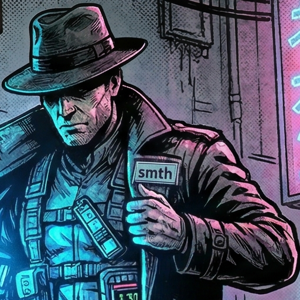

= Creative Material Needed for smth Website
:toc:

GitHub Pages site for https://calpano.github.io/smth (or similar).

== 1. Hero / Above the Fold

.Tagline
(1 line) — short, punchy.
____
Give your agent its own (phantom) browser. Launch in Node.js or Docker.
____

.Sub-tagline
(1–2 sentences) — expands on the hook without being a feature list.
____
smth is a local MCP server that lets your agent screenshot pages, inspect the DOM, check fonts and colors, and interact with forms — all in a persistent browser session.
____

.Hero visual — one of:
Use image:hero-image.png[]

- Animated GIF or MP4 of Claude using a smth tool in a real workflow (best option)
- Static screenshot of Claude's tool output (e.g. a color-pair WCAG report)
- Abstract illustration (lowest impact)
→ Need to decide and produce.

== 2. Logo / Icon 🕵️‍♀️

- Square PNG, ideally 512×512 (also used for Cline marketplace submission).
- The name "smth" lends itself to minimalist treatment — a browser window glyph,
  an eye, or a stylised "S".
- Dark and light variants preferred (for GitHub sidebar + website header).
- → Need to design or commission.




== 3. Feature Section

Three panels matching the existing See / Act / Compare grouping:

|===
| Panel | Icon needed | Copy needed

| See   | eye / magnifier | 2–3 sentence blurb on reading pages
| Act   | cursor / hand   | 2–3 sentence blurb on interacting
| Compare | diff / layers | 2–3 sentence blurb on snapshotting
|===

- Icon style: consistent set (line icons, filled, or emoji-style — pick one).
- Copy: short, benefit-focused, not a tool name list.
- → Need copy written and icons chosen/created.


== 4. Demo / Showcase

At least one end-to-end demo showing smth solving a real problem. Candidates:

a. **Accessibility audit** — `browser_see_color_pairs` on a real site showing WCAG failures.
b. **Content extraction** — `fetch_dom_content` stripping nav/footer, showing only article text.
c. **Mobile preview** — `browser_see_visual device="iPhone 15 Pro"` side by side with desktop.
d. **Before/after diff** — `browser_dom_compare` showing what changed after a click.

Format options:
- Animated GIF (loops, universal, no JS)
- MP4 with autoplay/muted (better quality, needs `<video>` tag)
- Static screenshots with annotations

→ Need to pick 1–2 scenarios and produce the assets.


== 5. Install Section

Copy for the two install paths:

- **Docker (persistent service):**
  ```bash
  git clone https://github.com/Calpano/smth
  cd smth && docker compose up -d
  ```
  + one-liner `.mcp.json` snippet.

- **Desktop Extension (one-click, coming soon):**
  Placeholder for when the Anthropic submission is approved.

→ Copy is mostly done (from README); needs visual treatment.


== 6. Tool Reference Table

A scannable table of all 16 tools — already exists in README.
→ Re-use as-is, or collapse into accordion for the site.


== 7. Social / Meta

- **og:image** (1200×630 px) — for Twitter/Slack link previews. Usually hero image + logo + tagline.
- **favicon** — 32×32 and 180×180 (Apple touch icon), derived from logo.
- **Page title tag** — `smth — Browser MCP Server` (already have this)
- **Meta description** (155 chars max) — needs writing.


== 8. Footer

- Links: GitHub repo · Issues · MIT License · Anthropic MCP docs
- Optional: "Built with smth" badge (SVG) for users to put in their own READMEs.


== Priority Order

1. Tagline (unblocks everything)
2. Logo/icon (needed for Cline submission anyway)
3. Hero demo GIF (highest conversion impact)
4. og:image (needed before any social sharing)
5. Feature copy (3 blurbs)
6. Everything else


the website should include the full examples from /doc folder.
For each tool, describe in detail how it works and what comes back.
Maybe create a shell script that launches a test server for @test-pages/test.html,
then starts asciinema recording of the demo.
then call each tool.
At the same time, show the description doc page contents.
Let user have next and rev buttons and a slow auto-advance.
So we get like 16 short demos, one per tool.


